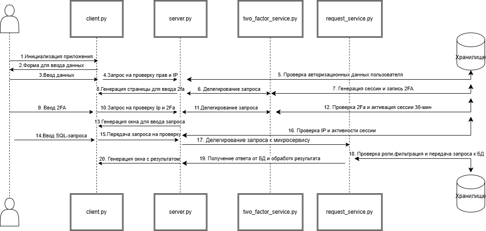
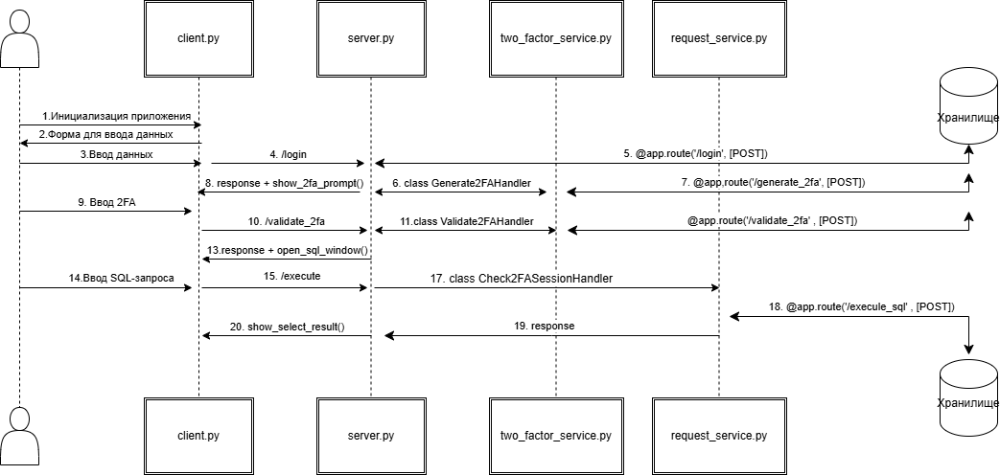

# TrainSafe
TrainSafe — это учебный проект, демонстрирующий микросервисный подход к разработке информационной системы с ролевым доступом, двухфакторной аутентификацией (2FA) и возможностью перехвата, аудита и выполнения SQL-запросов.


## Описание

### Основные задачи ПО
1.	Проверка IP-адреса клиента, от которого исходят запросы к БД. Если IP-адрес не входит в разрешенный диапазон, запросы игнорируются
2.	Генерация 2FA кода, который валиден в течение 5 минут
3.	Генерация сессии для успешно-авторизованного пользователя (после ввода 2FA с временем действия 30 мин)
4.	Проверка учетных данных пользователя
5.	Перехват, проверка и валидация SQL-запросов, исходящих от клиента
5.	Ведение реестра сессий
6.	Логирование запросов и ведение реестра логов

### Структура Проекта
    .
    ├── DB_init.py                                          # Скрипт с инициализацией БД
    ├── README.md                                           # Описание проекта
    ├── app-config.yaml                                     # K8s ConfigMap
    ├── client.py                                           # Клиентский интерфейс для взаимодействия с микросервисами
    ├── credit_train.csv                                    # Пример датасета для загрузки в БД 
    ├── docker-compose.yml                                  # Docker-compose файл
    ├── monitoring                                          # Папка с k8s манифестами Prometheus и Grafana
    │         ├── cadvisor-deployment.yaml
    │         └── prometheus-values.yaml
    ├── photos                                              # Папка с изображениями для README
    │         ├── Архитектура паттерна общая2.drawio.png
    │         └── Архитектура паттерна общая3.drawio.png
    ├── request_service                                     # Микросервис для обработки SQL-запросов
    │         ├── Dockerfile
    │         ├── request-service-deployment.yaml
    │         ├── request-service-service.yaml
    │         ├── request_service.py
    │         └── requirements.txt
    ├── requirements.txt                                    # Требуемые библиотеки
    ├── server                                              # Основной микросервис с применением паттерна "Цепочка ответственности"
    │         ├── Dockerfile
    │         ├── requirements.txt
    │         ├── server-deployment.yaml
    │         ├── server-service.yaml
    │         └── server.py
    └── two_factor_service                                   # Микросервис для генерации 2FA кодов и их проверкой
        ├── Dockerfile
        ├── requirements.txt
        ├── two-factor-service-deployment.yaml
        ├── two-factor-service-service.yaml
        └── two_factor_service.py


### Схемы взаимодействия
Диаграмма последовательности 1 (концептуальный уровень):



Диаграмма последовательности 2 (технический уровень):


## Установка

### Локальное использование
1. Клонирование репозитория
```bash
git clone https://github.com/EgorSinitsyn/TrainSave
```
2. Установка MySQL на локальную машину, убедитесь, что сервер запущен
3. Создайте файл .env в корне проекта, поместите туда креды от СУБД MySQL. В качестве примера в репозитории уже есть .env
4. Инициализируйте БД с нужной структурой 
```bash
python DB_init.py
```
5. Установка зависимостей
```bash
pip install -r requirements.txt
```
5. Запуск микросервисов
```bash
python server/server.py
python request_service/request_service.py
python two_factor_service/two_factor_service.py
```
6. Запуск клиентского интерфейса
```bash
python client.py
```


### Реализация через Docker-compose
1. Установка Docker и Docker-compose
2. Создание образов (опционально)
```bash
docker build -t server_module ./server
docker build -t request_service_module ./request_service
docker build -t two_factor_service_module ./two_factor_service
```
3. Запуск и билд контейнеров через Docker-compose
```bash
docker-compose up --build
```
4. Запуск клиентского интерфейса
```bash
python client.py
```
5. Взаимодейтсвие с мультиконтейнерным приложением через клиентское приложение. Скрипты микросервисов включать не нужно
6. Если мультиконтейнерное приложение запущено на удаленном хосте, измените эндпоинты в файле client.py (см. стоки 5 - 13)


### Реализация через Kubernetes (Minikube)
1. Старт Minikube
```bash
minikube start --cpus=4 --memory=5192
```
2. Проверяем запуск кластера
```bash
kubectl cluster-info
```
3. Применение ConfigMap
```bash
kubectl apply -f app-config.yaml
```
4. Применение деплойментов
```bash
kubectl apply -f ./server/server-deployment.yaml
kubectl apply -f ./request_service/request-service-deployment.yaml
kubectl apply -f ./two_factor_service/two-factor-service-deployment.yaml
```
5. Применение сервисов
```bash
kubectl apply -f ./server/server-service.yaml
kubectl apply -f ./request_service/request-service-service.yaml
kubectl apply -f ./two_factor_service/two-factor-service-service.yaml
```
6. Связываем локальный Docker с Minikube
```bash
eval $(minikube docker-env)
```
7. Создаем образы (обязательно выполнить пред команду)
```bash
docker build -t server_module ./server
docker build -t request_service_module ./request_service
docker build -t two_factor_service_module ./two_factor_service
```
8. Они обязательно должны отобразиться в Minikube
```bash
eval $(minikube docker-env)
docker images
```
9. Стягиваем образы в Minikube
```bash
minikube image load server_module:latest                                              
minikube image load request_service_module:latest
minikube image load two_factor_service_module:latest
```
10. Проверяем статус подов (должно быть running) и сервисов
```bash
kubectl get pods
kubectl get svc
```
11. Проброс локального хоста в Minikube
```bash
kubectl port-forward service/server-service 6000:6000
```
12. Делаем запросы через клиентское приложение на localhost:6000
